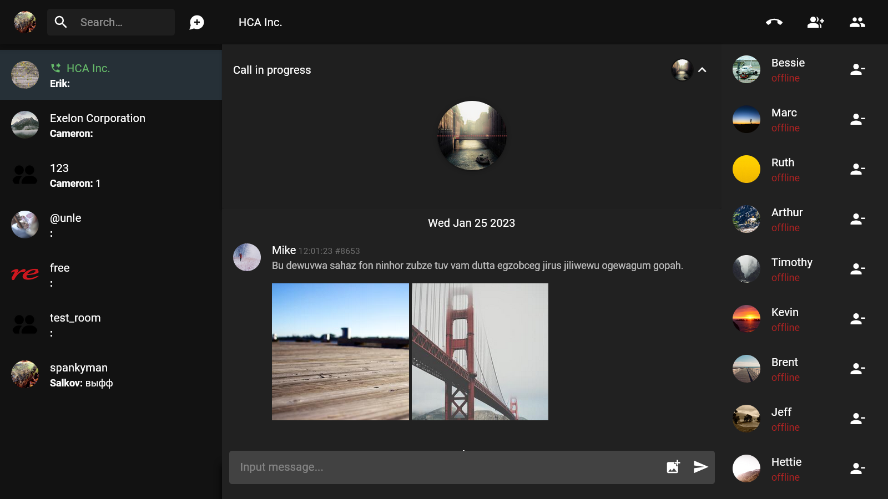
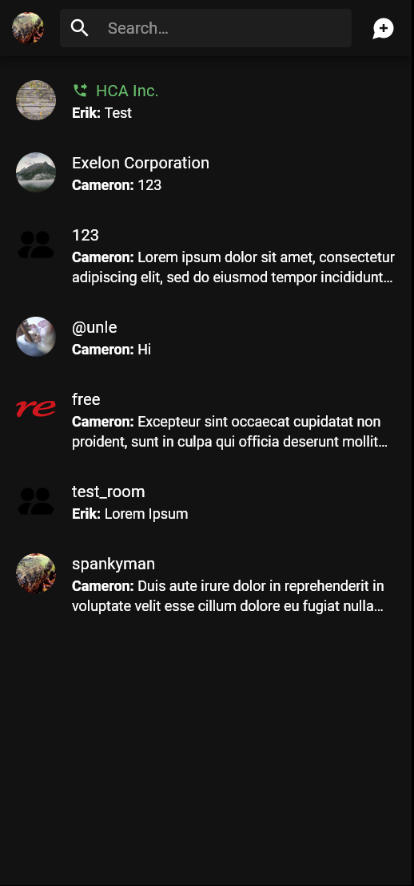
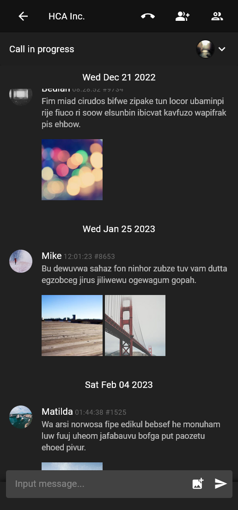
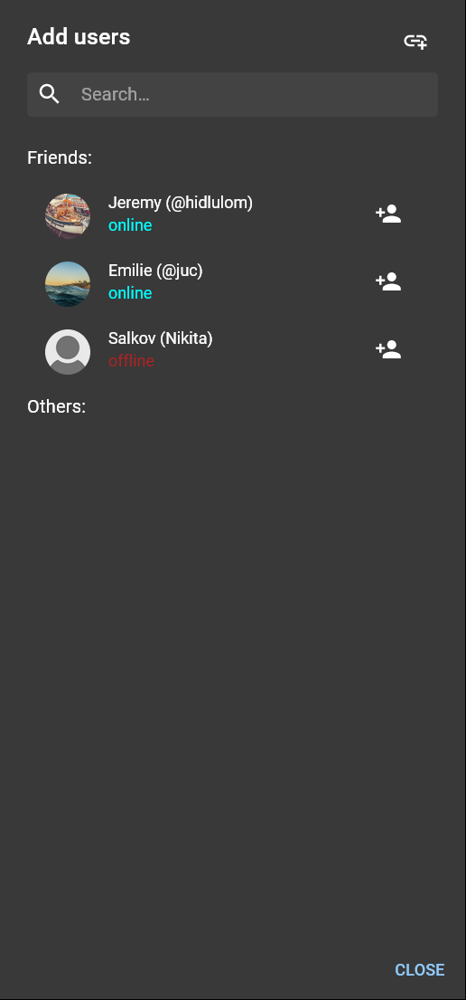

# 💬 Simple Communication App (SCA) — Frontend
Frontend part of Discord/Telegram-like messenger builded with Typescript (React + MobX + SocketIO).

  
  
  

## Demo
**App:** https://septerra.duckdns.org:44445/

Username: spankyman

Password: 123

**Api:** https://septerra.duckdns.org:44445/api/docs

## Features
* User's signin\signup, user's profiles, friends
* Instant messages, rooms, friend requests updates using SocketIO signaling
* Lazy loaded messages with image attachments at room's chat
* Real-time audio many-to-many conferences builded with Mediasoup and SocketIO
* Material design responsive UI builded with React and MUI